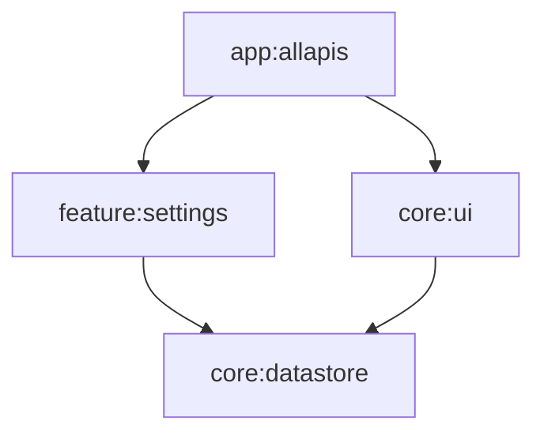

# AllApis

## Modules

## Links

### Modules

<pre>
.
├── <a href="./app/APP.md">app</a>
│   └── <a href="./app/allapis/ALLAPIS.md">allapis</a>
├── <a href="./feature/FEATURE.md">feature</a>
│   └── <a href="./feature/settings/SETTINGS.md">settings</a>
└── <a href="./core/CORE.md">core</a>
    ├── <a href="./core/datastore/DATASTORE.md">datastore</a>
    └── <a href="./core/ui/UI.md">ui</a>
</pre>
