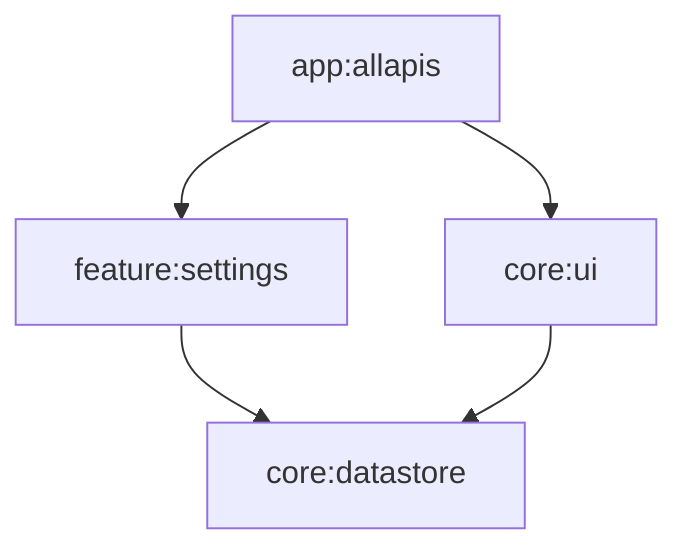

# AllApis

## Modules

```mermaid
graph TD
    app:allapis-->core:ui
    app:allapis-->feature:settings
    feature:settings-->core:datastore
    core:ui-->core:datastore
    core:datastore
```
## Links
### Modules

.
|-- app
|   \-- allapis
|-- feature
|   \-- settings
|-- core
    |-- datastore
    \-- ui
