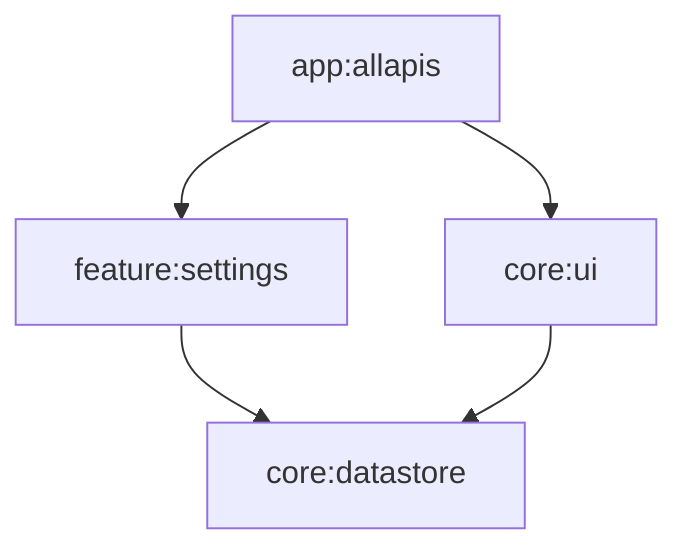

# AllApis

## Modules

```mermaid
graph TD
    app:allapis-->core:ui
    app:allapis-->feature:settings
    feature:settings-->core:datastore
    core:ui-->core:datastore
    core:datastore
```
## Links
### Modules

<pre>
.
├── [app](https://github.com)
│   └── allapis
├── feature
│   └── settings
└── core
    ├── datastore
    └── ui
```
</pre>
